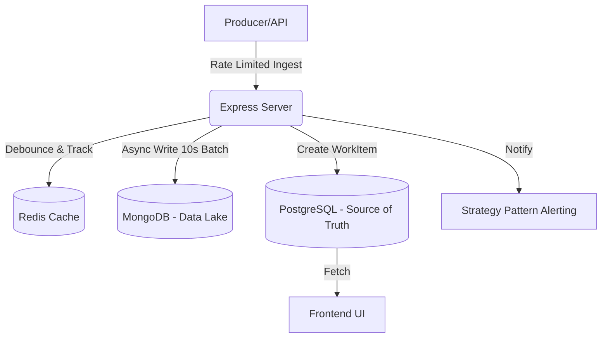

# Incident Management System (IMS)

## Architecture Overview
The system is built as a resilient pipeline combining Node.js (Express), Redis, PostgreSQL, and MongoDB. It uses an asynchronous queue and debouncing logic to ingest up to 10k signals/sec.

### Diagram


## Handling Backpressure & High-Throughput
To handle 10,000 signals/sec without crashing the RDBMS or dropping packets:
1. **Rate Limiting:** IP-based rate limiting via Redis ensures the system rejects malicious floods.
2. **In-Memory Buffering:** Signals are pushed to an in-memory buffer and flushed asynchronously using `insertMany` in MongoDB.
3. **Debouncing:** When 100 duplicate component failures arrive in 10s, Redis atomic operations (`INCR` with `EXPIRE`) ensure only the first signal triggers an actual WorkItem creation in the Source of Truth database. The rest are routed straight to the raw signal Data Lake with a link to the existing WorkItem.
4. **Retry Logic:** If the Data Lake is unavailable, the batch flush process employs a bounded retry mechanism with exponential backoff before sending signals to a DLQ (simulated).

## Design Patterns Used
1. **Strategy Pattern:** Used for alerting. Different severities (P0, P2) swap out the notification strategy dynamically (e.g., PagerDuty vs Slack).
2. **State Pattern:** Governs the Work Item lifecycle (`OPEN -> INVESTIGATING -> RESOLVED -> CLOSED`). Attempting invalid transitions throws errors, and moving to `CLOSED` demands an RCA object.

## Bonus / Non-Functional Features Implemented
To ensure enterprise-grade reliability suitable for an SRE environment, the following non-functional features were built into the core:
1. **Security Layer (DDoS Protection):** An IP-based Rate Limiter (via Redis) intercepts the API route, preventing malicious actors or rogue agents from flooding the ingestion endpoint. Standard CORS and Helmet-style protections are applied to the Express server.
2. **Performance (Debouncing & Async I/O):** The DB is protected by an intelligent debouncing layer (Redis `INCR` + `EXPIRE`), ensuring that a storm of 100 duplicate component failures only triggers *one* expensive Postgres transaction. The remaining 99 are non-blockingly buffered in memory and batched to MongoDB asynchronously.
3. **Resilience (Graceful Degradation):** If the external Redis or MongoDB Data Lake goes down, the system does not crash. It automatically falls back to an internal memory map for rate limiting and employs an exponential backoff loop for Data Lake retries.
4. **Observability:** Exposed a `/health` endpoint for external uptime probes and console-logged throughput metrics (`signals/sec`) for real-time monitoring.

## Setup Instructions

1. Start databases via Docker Compose:
```bash
docker-compose up -d
```

2. Start the Backend:
```bash
cd backend
npm install
npm run dev
```
*(Note: A `dev` script should be added running `ts-node-dev src/index.ts`)*

3. Start the Frontend:
```bash
cd frontend
npm install
npm run dev
```

4. Run Data Mocking:
```bash
cd backend
npm run mock
```
